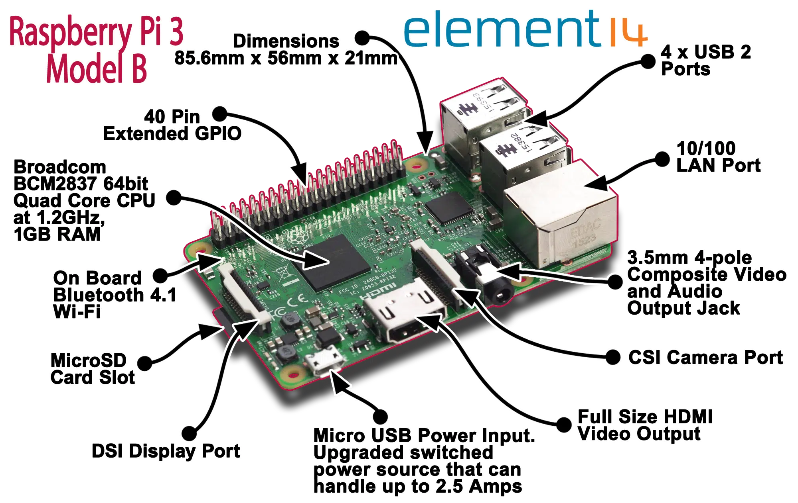
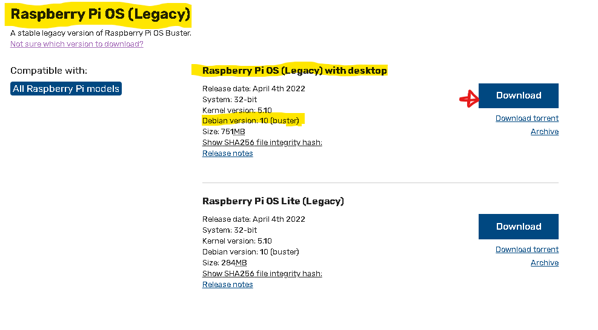

## Raspberry PI


Até agora em nosso curso, trabalhamos com pequenos projetos envolvendo sensores e atuadores, utilizando o Arduino UNO como nossa principal plataforma de hardware. Também exploramos integrações com Python e Node-Red.

Neste módulo, iniciaremos nossa imersão em computação embarcada voltada para a Internet das Coisas (IoT) utilizando o ``Raspberry PI``. Abordaremos tópicos como: introdução à Raspberry Pi, Sistema Operacional Linux, inicialização da placa Raspberry PI, configuração e uso dos GPIOs, integração com Arduino, Node-Red e muito mais.

## Conteúdo deste Laboratório

- Introdução à Raspberry PI e comparação com o Arduino.
- Primeiros passos com a Raspberry Pi:
    - Conhecendo o hardware.
    - Instalando o Sistema Operacional na Raspberry PI.
    - Modos de uso: GUI vs. Headless.
        - Configuração para acesso via SSH e Wi-Fi no modo Headless.
        - Uso do VNC Viewer.
        - Modo Desktop (GUI).
    - Controlando os GPIOs: Exemplo com LED.
        - Controle via linha de comando.
        - Uso de Shell Script.
        - E mais...

## Raspberry PI vs. Arduino

Lembrando do Arduino UNO que utilizamos, ele é baseado em um ``microcontrolador`` de 8-bit ([datasheet](https://ww1.microchip.com/downloads/en/DeviceDoc/Atmel-7810-Automotive-Microcontrollers-ATmega328P_Datasheet.pdf)). Sua arquitetura RISC é adequada para sistemas embarcados simples, mas não suporta um sistema operacional completo, o que pode limitar a implementação de sistemas mais avançados.

Para executar um sistema operacional completo, precisamos de um ``processador``, como os modelos Intel 386, i5, i7, Celeron, entre outros ([datasheet do Intel i7](https://www.intel.com/content/dam/www/public/us/en/documents/datasheets/core-i7-900-ee-and-desktop-processor-series-datasheet-vol-1.pdf)). Em aplicações de computação embarcada, muitas vezes optamos por uma alternativa mais compacta e econômica ao computador tradicional, como os ``SBCs`` (Single Board Computers).

Os SBCs são computadores completos em uma única placa, combinando processador, memória, suporte de rede, vídeo, áudio e outros recursos. São compactos e geralmente mais acessíveis que um computador convencional.

A ``Raspberry PI`` é um dos SBCs mais populares e versáteis disponíveis. Foi lançada em 2012 pela Raspberry Pi Foundation e utiliza processadores ARM da Broadcom, similares aos encontrados em smartphones. Desde seu lançamento, diversos modelos foram introduzidos, como a Raspberry PI 3, 4, Zero, entre outros.

> [Documentação oficial da Raspberry PI](https://www.raspberrypi.org/)

> [Outros modelos de SBCs](https://all3dp.com/pt/1/single-board-computer-computadores-placa-unica-alternativas-raspberry-pi/)

Com essa introdução, vamos aprender a utilizar a Raspberry PI.

## Desafio 1

Responda as perguntas abaixo:

!!! exercise choice "Question"
    Pergunta 1: Qual dos dois, Raspberry PI ou Arduino, é mais adequado para rodar um sistema operacional completo?

    - [X] Raspberry PI
    - [ ] Arduino
    - [ ] Ambos


    !!! answer
        O Raspberry PI possui capacidade de rodar um SO completo.

!!! exercise choice "Question"
    Pergunta 2: O Arduino UNO é baseado em qual tipo de componente central?

    - [X] Microcontrolador
    - [ ] Processador
    - [ ] Disco rígido
    - [ ] Placa de vídeo 


    !!! answer
        O arduino UNO é baseado em um microcontrolador.


!!! exercise choice "Question"
    Pergunta 3: Qual é a principal vantagem dos computadores de placa única (SBC) como o Raspberry PI em relação aos computadores convencionais?

    - [ ] Eles têm mais poder de processamento.
    - [ ] Eles podem executar múltiplos sistemas operacionais simultaneamente.
    - [ ] Eles são mais caros e robustos.
    - [X] Eles são de baixo custo e possuem pequenas dimensões.


    !!! answer
        Eles são de baixo custo e possuem pequenas dimensões.


!!! progress
    Continuar...

## Raspberry PI - Primeiros Passos

### Visão Geral

Há vários modelos de Raspberry PI disponíveis. Em nosso curso, focaremos na [``Raspberry PI 3 Model B+``](https://www.raspberrypi.com/products/raspberry-pi-3-model-b-plus/).




> **Complemento**:
> - Fonte de Alimentação: 5V @ >2A
> - Cartão SD: micro SD Card >8GB Classe 10 ou superior

### Sistema Operacional

Existem várias distribuições de sistemas operacionais compatíveis com a Raspberry PI, incluindo:

- Raspbian - Uso geral.
- Ubuntu - Uso geral.
- RetroPie - Emulador de videogame.
- OSMC - Media Center.
- Home Assistant - Automação residencial.
- E muitos outros...

> Chega de teoria! Vamos à prática. Siga este guia atentamente e execute todos os passos.

!!! progress
    Continuar...

### Instalando o Sistema Operacional

O sistema operacional da Raspberry PI é armazenado em um ``micro SD Card``. Recomenda-se usar um cartão de pelo menos 8GB Classe 10 ou superior. Existem várias maneiras de instalar o sistema operacional, e aqui, vamos guiá-lo passo a passo.

As versões do sistema operacional podem ser encontradas [aqui](https://www.raspberrypi.com/software/operating-systems/). Em nosso curso, utilizaremos o ``Raspberry Pi OS (legacy)``, baseado no Debian 10 (Buster).



!!! info
    Para facilitar, [aqui está o link para download](https://downloads.raspberrypi.org/raspios_oldstable_armhf/images/raspios_oldstable_armhf-2022-04-07/2022-04-04-raspios-buster-armhf.img.xz).

Para gravar o cartão SD, recomendamos o uso do ``Balena Etcher``, disponível para várias plataformas.

> [Link para download do Balena Etcher](https://www.balena.io/etcher/)

Siga os passos abaixo para preparar seu cartão SD:

1. Insira o cartão SD no adaptador USB e conecte-o ao seu computador.
2. Baixe o Raspberry Pi OS.
3. Baixe e instale o Balena Etcher.
4. Abra o Balena Etcher e siga os passos para gravar o cartão SD.
5. Após a gravação, reconecte o adaptador USB ao computador.
6. Você deve ver duas partições, uma delas chamada "boot". Se não, formate o cartão SD em FAT32 e repita o processo.

!!! progress
    Continuar...

### Modo de Uso - Interface Gráfica

> **Nota**: Esta seção é apenas para conhecimento adicional, pois **não usaremos a Raspberry PI desta maneira em nosso curso**.

Para usar a Raspberry PI como um computador convencional, conecte um monitor via HDMI, um teclado e um mouse. Insira o cartão SD gravado e conecte a fonte de alimentação. O sistema operacional será inicializado e estará pronto para uso.


### Modo de Uso - Headless

Nesta seção, aprenderemos a usar a Raspberry PI no modo ``Headless``, sem a necessidade de monitor, teclado ou mouse. Algumas configurações são necessárias antes de iniciar a Raspberry PI neste modo.

#### Habilitando SSH

Para ativar o acesso SSH, crie um arquivo vazio chamado "ssh" na pasta "boot" do cartão SD.

Siga os passos abaixo:

1. Conecte o cartão SD ao adaptador USB e insira-o no computador.
2. Acesse a partição chamada "boot".
3. Crie um arquivo chamado "ssh" (sem extensão) na raiz da partição.

O resultado deve ser semelhante ao mostrado na imagem:


!!! progress
    Continuar...

#### Configurando a Rede Wi-Fi

A configuração da rede Wi-Fi é feita através do arquivo "wpa_supplicant.conf", que deve ser criado na pasta "boot" do cartão SD.

Siga as instruções abaixo para configurar sua rede Wi-Fi:

1. Crie um arquivo chamado "wpa_supplicant.conf" na raiz da partição "boot".
2. Abra o arquivo com um editor de texto e configure-o de acordo com o exemplo fornecido.

> **Nota**: Certifique-se de estar conectado à mesma rede Wi-Fi que a Raspberry PI.

Agora, com tudo configurado, é hora de ligar a Raspberry PI e testá-la.

## Desafio 2

Responda as perguntas abaixo:

!!! exercise choice "Question"
    Pergunta 4: Qual é a principal função do arquivo `wpa_supplicant.conf` na pasta `boot` do Raspberry PI?

    - [ ] Habilitar o SSH.
    - [X] Configurar a rede Wi-Fi.
    - [ ] Iniciar o sistema operacional.
    - [ ] Configurar a saída de vídeo.

    !!! answer
        Configurar a rede Wi-Fi.


!!! exercise choice "Question"
    Pergunta 5: Ao configurar o Raspberry PI no modo `Headless`, o que é necessário fazer para habilitar o acesso SSH?

    - [ ] Criar um arquivo chamado `ssh` na pasta `home`.
    - [X] Criar um arquivo chamado `ssh` na pasta `boot`.
    - [ ] Instalar um software adicional.
    - [ ] Configurar o firewall para permitir o acesso SSH.

    !!! answer
        Criar um arquivo chamado `ssh` na pasta `boot`.


!!! exercise choice "Question"
    Pergunta 6: Qual software é recomendado para acessar o Raspberry PI via SSH a partir de um computador?

    - [ ] WinRAR
    - [ ] Balena Etcher
    - [X] PuTTY
    - [ ] Microsoft Word

    !!! answer
        PuTTY


!!! progress
    Continuar...

## Primeiro Teste com a Raspberry PI

Para nosso primeiro teste, montaremos um circuito simples para acender um LED. Siga o esquema abaixo:


No terminal da Raspberry PI, execute os comandos a seguir para controlar o LED:

```shell
# Configura o pino GPIO 17 como saída (output)
echo "17" > /sys/class/gpio/export
echo "out" > /sys/class/gpio/gpio17/direction

# Acende o LED (nível lógico alto)
echo "1" > /sys/class/gpio/gpio17/value

# Apaga o LED (nível lógico baixo)
echo "0" > /sys/class/gpio/gpio17/value

# Libera o pino GPIO 17
echo "17" > /sys/class/gpio/unexport
```

Se tudo funcionou corretamente, você deve ter visto o LED acender e apagar.


## Desafio 3

Agora é sua vez! A Raspberry PI permite controlar seus pinos GPIO usando várias linguagens de programação. Escolha sua linguagem preferida e escreva um código para fazer o LED piscar a cada segundo. Aqui está um exemplo para ajudá-lo. [Acesse Aqui](https://medium.com/geekculture/how-to-blink-led-using-raspberry-pi-8351b06348d7) 


