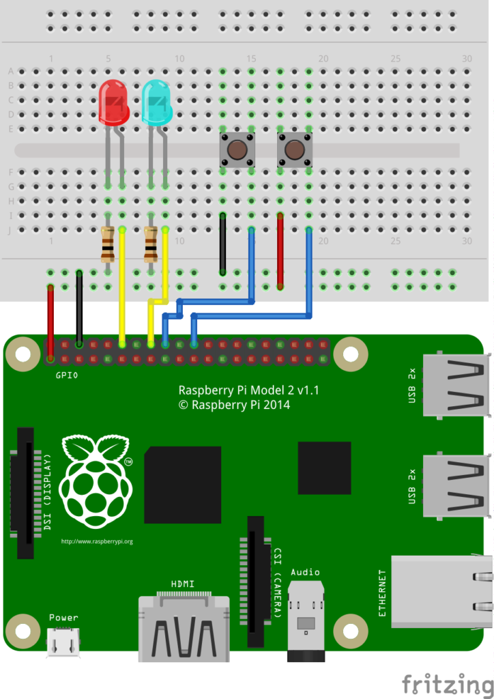
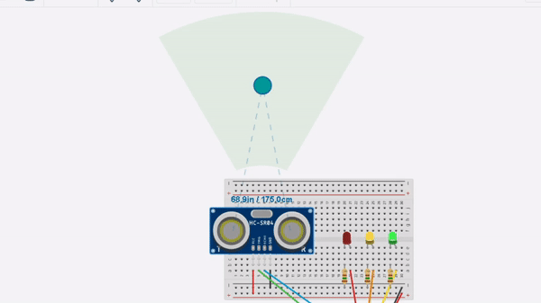

## O que vamos ver neste lab?

- Raspberry Pi: 
    - Conhecendo os pinos
    - Usando a biblioteca RPI.GPIO 


!!! progress
    Continuar...


## Conhecendo os pinos da Raspberry Pi

Podemos utilizar a Raspberry Pi para conectar sensores e atuadores, de forma semelhante como foi feito utilizando o Arduino, para isso utilizamos os barramento de pinos da Raspberry Pi chamado de GPIO (General Purpose Input Output). Ao todo são 40 pinos (para RPI 2 ou superior) e de forma geral cada pino possui uma função ou caracteristica especifica.

!!! Warning
    Cuidado: Devemos ter atenção para não conectar os perifericos na placa de forma incorreta. Existe risco de queimar a Raspberry Pi.  

A imagem abaixo é um guia simples para cada pino. Parece complicado na primeira vez, mas é tranquilo.


Vamos conhecer o que é cada pino:

    - Pinos de Alimentação: 
        - 3.3V (ao todo 2 pinos)
        - 5V (ao todo 2 pinos)
        - GND/Ground/0V (ao todo 8 pinos)
    
    - Pinos de interface:
        - GPIO (General purpose input and output): São os pinos de entrada/saida. A tensão de saida é de 3.3V.
        - I2C/SPI/UART: Protocolos de comunicação especificos utilizados para realizar a interface módulos epecificos com a Raspberry Pi.
 
!!! Warning
    Atenção: Observe a correlação dos pinos para não ligar invertido.
    
     

!!! exercise
    Quantos pinos GPIO estão disponiveis?


!!! progress
    Continuar...


## Configurando os GPIOs

No final do lab07 montamos um simples pisca led e programamos configurando os valores dos registradores. Existem formas mais simples de programar os GPIOs da rasbperry pi, vamos programar em Python :) 

Vamos utilizara biblioteca ``RPI.GPIO``, que permite de forma simples configurar e usar os GPIOs com script em Python, vamos preparar o nosso ambiente de desenvolvimento:

!!! exercise
    - Inicialize a Raspberry Pi. (modo Desktop ou SSH).

        - Se tiver dúvida de como fazer, volte para o lab07.
        
    - Abra o terminal da raspberry pi.

    - Certifique-se de estar com acesso a internet.


No terminal da raspberry pi, atualize os repositórios:

```bash

sudo apt update

```   
 
Em seguida, tente instalar o pacote RPi.GPIO: A documentação da biblioteca está disponivel no [aqui](https://pypi.org/project/RPi.GPIO/).

```bash

sudo apt install rpi.gpio

```  

Se ainda não estiver instalado, será instalado. Se já estiver instalado, será atualizado se uma versão mais recente estiver disponível.


!!! progress
    Continuar...


### Conhecendo a biblioteca RPi.GPIO

É uma biblioteca simples de usar e vamos ver as principais funções da RPi.GPIO através do código de exemplo abaixo:

- ``GPIO.setmode()`` = Define o modo de acesso aos pino da raspberry pi, existem 2 modos de definir a mesma coisa:
    
    - GPIO.BOARD  = Posição física do pino na raspberry pi
    - GPIO.BCM    = Numero após GPIOxx

> exemplo:
> BOARD 11 = GPIO17


- ``GPIO.setup()`` = Define a função do pino, entrada (GPIO.IN) ou saida (GPIO.OUT)

- ``GPIO.output()`` = Define o estado do pino definido como saida em nivel logico baixo (GPIO.LOW) ou alto (GPIO.HIGH)

- ``GPIO.input()`` = Faz a leitura do estado do pino definido como entrada. Geralmente quando usamos um pino como entrada configuramos no setup o parametro pull_up_down (como exemplo: GPIO.setup(18, GPIO.IN, pull_up_down=GPIO.PUD_UP))


!!! exercise
    Monte o circuito abaixo:
    
    
    
    - No terminal da RPI, digite:
    
    ```shell
    cd ~
    mkdir src
    cd src
    touch blinkled.py  

    ``` 
    
    - Criamos um diretorio chamado src e um arquivo python chamado blinkled.py
    - Abra o arquivo blinkled.py e escreva o código abaixo.
    - Para abrir o arquivo digite: nano blinkled.py
    - Após digitar o código python, salve e feche o arquivo: Ctlr+X >>> Y 
    - Vamos rodar nosso código python, no terminal digite:
        * python blinkled.py
    
    - Se tudo deu certo, o led está piscando. :)
        - para interromper o código aperte Ctrl+C.

!!! Warning
    Os 2 códigos realizam a mesma função, a diferença está apenas no **setmode**. Escolha um dos códigos para testar. 

    ```python    
    import RPi.GPIO as GPIO  ### import da biblioteca gpio
    import time

    # usando o a posição fisíca do pino na raspberry pi
    GPIO.setmode(GPIO.BOARD)
     
    # configura o pino fisico 11 como saida
    GPIO.setup(11, GPIO.OUT)

    whille True:  
        # escreve no pino 11 nivel logico alto
        GPIO.output(11, GPIO.HIGH)
        time.sleep(1) # delay de 1s
    
        # escreve no pino 11 nivel logico baixo
        GPIO.output(11, GPIO.LOW)
        time.sleep(1) # delay de 1s

    GPIO.cleanup()  # Limpa configuração finaliza o programa

    ```
    
    ``` python 
    import RPi.GPIO as GPIO  ### import da biblioteca gpio
    
    # usando o numero após GPIOxx da raspberry pi
    GPIO.setmode(GPIO.BCM)
    
    # configura o GPIO17 como saida
    GPIO.setup(17, GPIO.OUT)
    
    whille True:  
        # escreve no GPIO17 nivel logico alto
        GPIO.output(17, GPIO.HIGH)
        time.sleep(1) # delay de 1s
    
        # escreve no GPIO17 nivel logico baixo
        GPIO.output(17, GPIO.LOW)
        time.sleep(1) # delay de 1s

    GPIO.cleanup()  # Limpa configuração finaliza o programa
    
    ```

## Desafios
    
Agora que já entendemos a estrutura básica do script python, faça os `Desafios` abaixo.


!!! exercise
    Semáfaro de transito: 
    
        - Monte um circuito com 3 leds (1 verde, 1 amarelo, 1 vermelho);
        - crie um novo script chamado semaforo.py;
        - Escreva um código que irá acender os leds na sequência e intervalo:
            - Verde (5segundos)
            - Amarelo (3segundos)
            - Vermelho (6segundos)
            - loop (volta para o verde)

    
!!! exercise
    leitura de botão e Led: 
    
    - Monte o circuito: 

    
    
    - Escreva um código que:
        - Enquanto nenhum botão for pressionado, os leds ficam apagados;
        - Se o botão1 for pressionado:
            - os leds acendem na sequência: Verde - Amarelo - Vermelho
        - Se o botão2 for pressionado:
            - os leds acendem na sequencia: Vermelho - Amarelo - Verde 
    
    > Dica: Geralmente quando usamos algum pino como entrada configuramos no setup o parametro pull_up_down (como exemplo: GPIO.setup(18, GPIO.IN, pull_up_down=GPIO.PUD_UP) ou GPIO.setup(18, GPIO.IN, pull_up_down=GPIO.PUD_DOWN).

!!! exercise
    Sensor de temperatura: Para quem tiver curiosidade pode dar uma olhada como utilizar o sensor de temperatura DTH11 [neste link](https://www.filipeflop.com/blog/raspberry-pi-umidade-e-a-temperatura-com-o-sensor-dht11/).


!!! exercise

    
    
    Desenvolva um Sensor de estacionamento veicular. A idéia é simples. Vamos utilizar 1 sensor de distância ultrassônico e 3 leds de cores difenciadas. Parte do problema já está resolvido você pode acessar o [tutorial](https://labprototipando.com.br/2020/06/22/como-configurar-o-sensor-de-distancia-hc-sr04-no-raspberry-pi/) adaptar o código do Sensor HC-SR04 e implementar a logica dos led.
