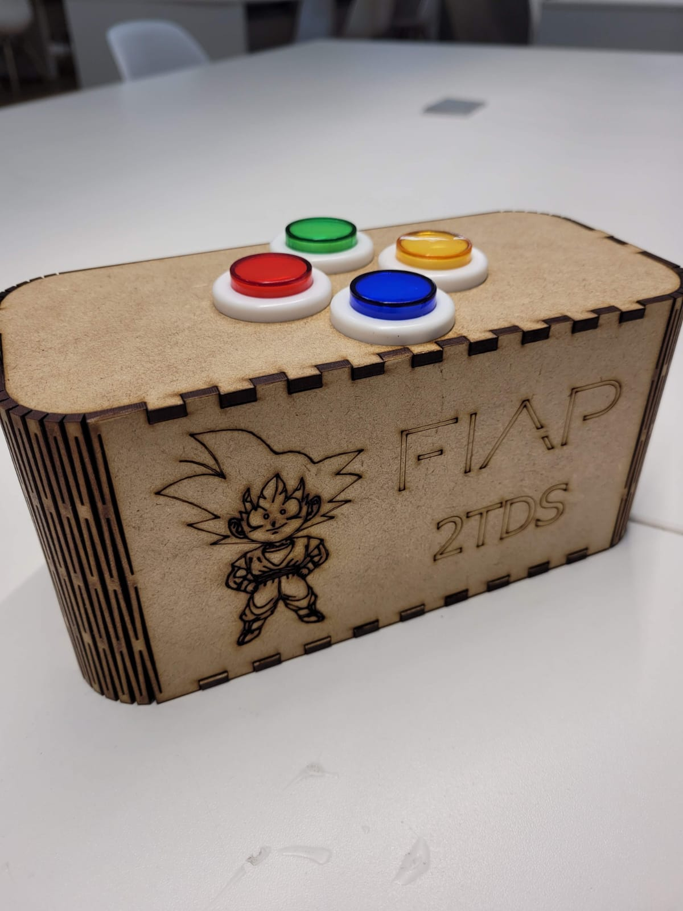

# CHECKPOINT 4

Leia com atenção as instruções gerais sobre o checkpoint.

- O objetivo do checkpoint é avaliar sua compreensão acerca do conteúdo ministrado pela disciplina.

## FORMULÁRIO DE ENTREGA

FORMULÁRIO PARA ENTREGA DO PROJETO - O GRUPO DEVE PREENCHER: [https://forms.gle/8g6gi5LL3gyvh3sX9](https://forms.gle/8g6gi5LL3gyvh3sX9)

## Ideia geral

Neste checkpoint, vocês irão desenvolver o protótipo de um sistema de identificação IoT, que em linhas gerais possuirá as seguintes interfaces:

## Rubrica

***(R1 - NOTA 6)*** Os requisitos funcionais mínimos do sistema devem seguir a arquitetura abaixo:

Para atender a esta rubrica, o sistema está dividido em 2 fluxos: 

Fluxo 1: Deve ser capaz de coletar a identificação da TAG RFID com o Arduino (ARDUINO1) e enviar, utilizando formato JSON, para um fluxo Node-Red que realiza duas funções:
    
- Publica em um tópico utilizando o protocolo MQTT;
- Notifica o usuário via outro canal de comunicação (E-mail, Telegram, Whatsapp, etc...)

Fluxo 2: O fluxo do Node-Red subscreve o tópico e exibe o valor da TAG em um DASHBOARD.

***(R2 - NOTA 7)*** Os requisitos funcionais mínimos do sistema devem seguir a imagem abaixo:

Para atender a esta rubrica, implemente a rubrica R1, e faça a atualização necessária onde o sistema deve se comunicar com o segundo Arduino (ARDUINO2) no formato JSON para realizar o controle de posição do servo motor.

- A posição do servo motor é controlada pelo DASHBOARD;
- o usuário recebe a notificação do sistema por outro canal de comunicação (E-mail, Telegram, Whatsapp, etc...)

***(R3 - NOTA 8)*** Os requisitos funcionais mínimos do sistema devem seguir a imagem abaixo:

Para atender a esta rubrica, implemente a rubrica R2, e o sistema do servidor Node-Red deve estar embarcado na Raspberry PI, sendo capaz de coletar dados do sensor DTH11 (Temperatura e Umidade) a cada 30s. As informações do sensor são sempre exibidas no Dashboard e enviadas para o usuário apenas se a umidade estiver abaixo de 50% ou a temperatura estiver acima de 30°C.

***(R4 - NOTA 10)*** Os requisitos funcionais mínimos do sistema devem seguir a imagem abaixo:

Para atender a esta rubrica, implemente a rubrica R3, e adicione a integração com algum banco de dados e implementação mobile (o grupo define a linguagem de programação).

***(BONUS - 2 pontos )*** MVP do projeto:

Desenvolva uma caixa para acomodar os hardware do projeto, que pode ser desenvolvida pelo MakerLab utilizando a impressora 3D ou MDF cortado no laser.

## Entrega e Apresentação do projeto:

- O projeto pode ser realizado individualmente ou por grupos no máximo 5 alunos.
- OBRIGATÓRIO Entrega via GitHub. Apresente o repositório ORGANIZADO do projeto com toda a documentação e instruções README.
- Grave um vídeo curto demonstrando o funcionamento de acordo com a rubrica.
